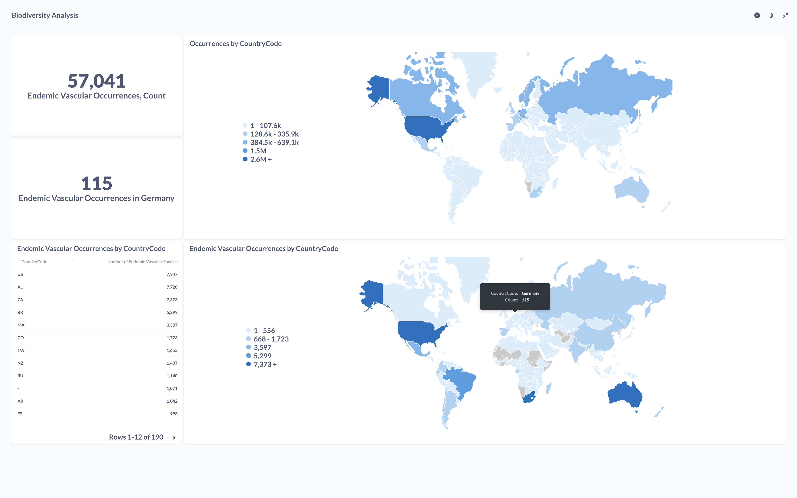

# OEF Biodiversity Analysis

## How to Run Locally

- **Set Up Docker Environment**:
    - Run `docker-compose up -d` to start the Postgres database and Metabase services.

- **Python Virtual Environment**:
    - Create and activate a Python virtual environment in the project directory:
  
```
python -m venv venv
source venv/bin/activate
pip install -r requirements.txt
```

- **Data Preparation**:
    - Create a directory named `.data`.
    - Download the dataset from [GBIF API](https://api.gbif.org/v1/occurrence/download/request/0030197-231120084113126.zip) and save it as `.data/0030197-231120084113126.csv`.
    - If you have difficulty downloading the file, pls check "GBIF Dataset Download Information" below.

- **Load Data into table `occurrence`**:
    - Execute the data loading script with `python load_data.py`.

- **Creation of Database Table `endemic_vascular_occurrences`**:
    - Create the necessary table by running `create_table_endemic_vascular_occurrences.sql`.
  
- **Connect to Metabase**
    - Once the services are running, and the tables are created, you can access Metabase by navigating to http://localhost:3000 in your web browser.

## About Data Sources

Initial exploration of data sources led to the identification of the following relevant data sources:

- **GBIF Species Search (GBIF)**: A comprehensive database from the Global Biodiversity Information Facility, offering detailed records of species occurrences.
- **IUCN Red List - Europe (IUCN Red List)**: Provides an extensive list of species categorized by their conservation status in Europe.
- **Global Species Database (World Bank)**: Includes global biodiversity information, useful for comparative studies.
- **Catalogue of Life**: A comprehensive and authoritative global index of species.
- **Species 2000**: Aims to index all known species, providing a dynamic and controlled list of names and taxonomic information.

Maureen's previous research highlighted GBIF as a reliable source. This analysis therefore primarily utilizes GBIF data for demonstration purposes.

Further examination of GBIF data sources revealed:

- **gbif_datasets.csv**:
    - Identified relevant datasets for vascular plants in Germany, such as "The Leipzig catalogue of vascular plants" and "Taxon list of vascular plants from Bavaria, Germany".
    - These datasets are region-specific and seem incomplete.

- **Backbone - Distribution.tsv**:
    - Covers all names GBIF deals with but lacks direct information to classify vascular plants.

- **Species_Database_wb_datanam**:
    - Filtering for vascular plants in Germany resulted in approximately 700 records, which seems incomplete.

- **Occurrences**:
    - Contains detailed information about species occurrences and is suitable for identifying biodiversity hotspots and species richness.
    - Filters applied: occurrences_status=present, scientific_name=tracheophyta, year: 2023.

Based on this analysis, the occurrences dataset with the specified filters was chosen.

## About the Solution

- **Data Import**:
    - Approach involves manual download of the dataset into the `.data` directory and loading it via a Python script.
    - An API approach via [GBIF API](https://www.gbif.org/developer/occurrence) was considered but not implemented due to time constraints.

- **Data Storage**:
    - For handling a 6GB dataset, relevant fields are loaded into a Postgres DB using pandas and SQLAlchemy.
    - For very large datasets, consider using PostgreSQL's efficient bulk loading method such as the COPY command.

- **Data Analysis**:
    - Metabase, an open-source data analytics tool, is used for analysis.

## Methodology of Analysis

- **Determine Endemism**:
    - Compare the species list in a global database to identify endemic species.
    - The table `endemic_vascular_occurrences` displays all endemic vascular species and their occurrence countries.

- **Count Endemic Species by CountryCode**:
    - To qualify as a hotspot, a region must have at least 1,500 endemic species of vascular plants.
    - In Germany, the count of vascular plants is 115 as per the table `endemic_vascular_occurrences`.

## Key Findings from Biodiversity Analysis

1. **Global Endemic Vascular Species Count**:
  - Our study identified a total of 57,041 endemic vascular species across the globe. This significant number underscores the vast diversity of vascular plants unique to specific regions worldwide.

2. **Endemic Vascular Species in Germany**:
  - Out of the global count, 115 endemic vascular species are found in Germany. While this demonstrates a notable variety of unique plant life within Germany, it falls short of the threshold to classify the country as a biodiversity hotspot.
  - The criterion for a biodiversity hotspot, as defined in our analysis, requires a region to have at least 1,500 endemic species of vascular plants. Therefore, Germany does not meet the criteria to be identified as a biodiversity hotspot based on this measure.

3. **Countries with High Endemic Species Counts**:
  - Our analysis revealed that there are seven countries each harboring more than 1,500 endemic vascular species, thereby qualifying them as biodiversity hotspots.
  - A notable example is the United States, which boasts an impressive count of 7,947 endemic vascular species. This high number highlights the ecological uniqueness and importance of the United States in terms of plant biodiversity.

These findings provide valuable insights into global biodiversity patterns, particularly in the context of vascular plant species. They emphasize the importance of targeted conservation efforts in regions with high endemic species counts and the need for continued research and monitoring to protect these vital ecological assets.




## GBIF Dataset Download Information

- Download Information

DOI: https://doi.org/10.15468/dl.yan3mt (may take some hours before being active)
Creation Date: 11:22:16 17 December 2023
Records included: 10422393 records from 442 published datasets
Compressed data size: 1.5 GB
Download format: simple tab-separated values (TSV)
Filter used:
{
"and" : [
"OccurrenceStatus is Present",
"TaxonKey is Tracheophyta",
"Year 2023-2023"
]
}

- Download file retention

Information about this download will always be available at https://doi.org/10.15468/dl.yan3mt and https://www.gbif.org/occurrence/download/0030197-231120084113126

The simple tab-separated values (TSV) file will be kept for six months (until 17 June 2024). You can ask us to keep the file for longer from https://www.gbif.org/occurrence/download/0030197-231120084113126

If you cite this download using the DOI, we will usually detect this and keep the file indefinitely.

For more information on this, see https://www.gbif.org/faq/?question=for-how-long-will-does-gbif-store-downloads


## Future Improvements with Additional Time

Given more time, there are several enhancements and explorations I would pursue to further enrich this project:

1. **GBIF API Integration**:
    - I would explore the GBIF API documentation in-depth to implement direct data fetching from the API. This would automate the process of downloading and updating the dataset, making the data import process more efficient and dynamic.
    - Integrating with the GBIF API would also allow for more selective data retrieval, enabling us to fetch only the most relevant and up-to-date data as needed for our analysis.

2. **Analysis by WWF Ecoregions**:
    - Another exciting avenue for deeper analysis would be to segment the biodiversity data by WWF ecoregions. This would involve mapping the occurrence data to specific ecoregions defined by the World Wildlife Fund, allowing for a more nuanced understanding of biodiversity patterns.
    - Analyzing data per ecoregion could reveal insights into the unique ecological characteristics of different areas, potentially highlighting specific regions that require more focused conservation efforts or further study.

These additional steps would significantly enhance the depth and utility of our biodiversity analysis, providing a more comprehensive view of the ecological landscape.
